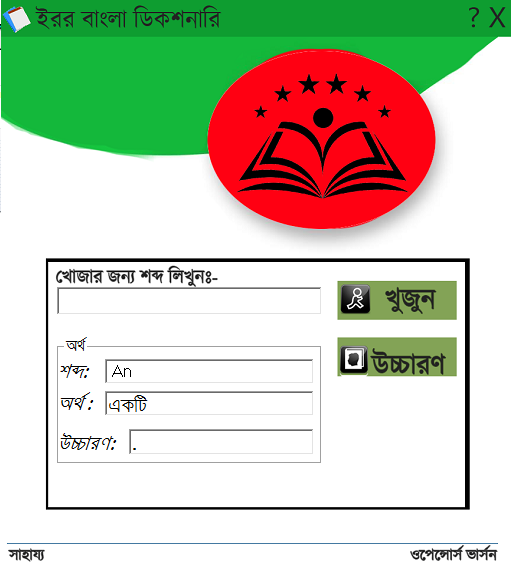

It's a Bangla Dictionary based on a simple DB of 8667 words.
Information:
Programming Language: VB
Compiler: VB6
Database: MS Access 2003
Data: 8667

Features:
1.Full Bangla Interface
2.Attractive Interface with non border UI.
3.English to Bangla Dictionary.
4.Pronounciation
5.Easy & Friendly UI
6.Fully open source & free.

Screenshot:

